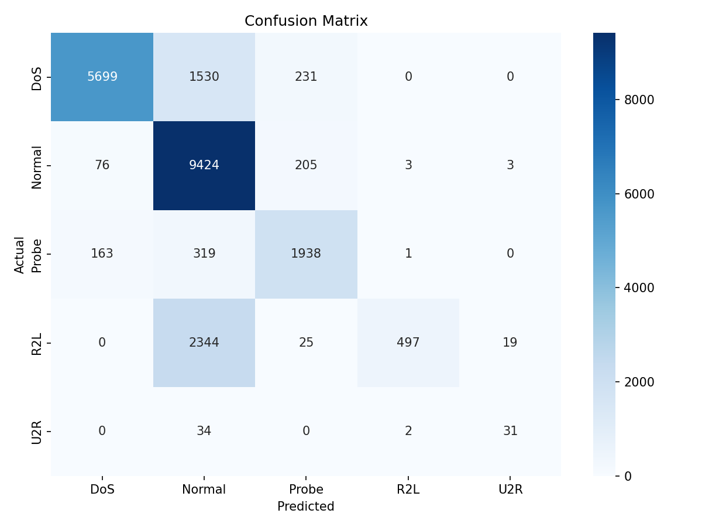

# **Model Training Assignment**

\---

**Course:** Advanced Python (ICS0019)

**Team members:** Kermo Kolsar, Yuliia Sidelnik

**Date:** 25.05.2026

Repository link: [https://github.com/LemonMeringue1/ics0019-model-training](https://github.com/LemonMeringue1/ics0019-model-training)

\---

## **1. Approach**

### **1.1 Strategy Overview**

Our strategy is to start with a barebones model and test various hyperparameters and dataset resampling techniques such as SMOTE, undersampling, etc. If an approach significantly improves overall precision and recall, we will incorporate it into our final model. If an approach does not significantly improve overall precision or recall, but does, for example, significantly improve recall in U2R and R2L, at the cost of precision and recall in other categories, we will observe this and conduct tests to find a good balance of this approach with all other approaches.

### **1.2 Preprocessing**

* **Feature engineering:** No new features are created.
* **Feature selection:** All features with importance <0.01 are removed. All remaining features still account for a large majority of importance. Removing these features does not significantly affect F1-score (0.6229 -> 0.6230 in baseline model)
* **Scaling:** None, because scaling does not affect XGBoost.

### **1.3 Class Imbalance Handling**

* **Method used:** SMOTEENN
* **Parameters:** random\_state=42, sampling strategy=’not majority’
* **Effect on training set distribution:** underrepresented classes are oversampled.

\---

## **2. Experiments**

### **Total number of experiments:**

### **Experiment 1: Baseline (no hyperparameter tuning, no class imbalance handling, no unimportant feature removal)**

* **Algorithm:** XGBoost
* **What changed from baseline:** This is the baseline
* **Macro F1 (CV):** 0.9455
* **Macro F1 (test):** 0.5336
* **Observation:** Baseline already beats required 0.47 macro F1.

### **Experiment 2: Baseline with SMOTE**

* **Algorithm:** XGBoost
* **What changed:** added SMOTE
* **Macro F1 (CV):** 0.9998
* **Macro F1 (test):** 0.6161
* **Observation:** SMOTE significantly increases F1 from baseline

### **Experiment 3: Baseline with RandomOverSampler**

* **Algorithm:** XGBoost
* **What changed:** added RandomOverSampler
* **Macro F1 (CV):** 0.9998
* **Macro F1 (test):** 0.5966
* **Observation:** improves from baseline, but not as much as SMOTE

### **Experiment 4: Baseline with RandomUnderSampler**

* **Algorithm:** XGBoost
* **What changed:** added RandomUnderSampler
* **Macro F1 (CV):** 0.9181
* **Macro F1 (test):** 0.5544
* **Observation:** slightly improves from baseline, not nearly as much as SMOTE

### **Experiment 5: Baseline with SMOTEENN**

* **Algorithm:** XGBoost
* **What changed:** added SMOTEENN
* **Macro F1 (CV):** 0.9999
* **Macro F1 (test):** 0.6229
* **Observation:** largest improvement from baseline out of all tested dataset resampling techniques.

### **Experiment 6: Baseline with SMOTETomek**

* **Algorithm:** XGBoost
* **What changed:** added SMOTETomek
* **Macro F1 (CV):** 0.9998
* **Macro F1 (test):** 0.6228
* **Observation:** essentially the same improvement from baseline as SMOTEENN

### **Experiment 7: Baseline with SMOTEENN and unimportant features removed**

* **Algorithm:** XGBoost
* **What changed:** resampled training dataset with unimportant (importance < 0.01) removed.
* **Macro F1 (CV):** 0.9998
* **Macro F1 (test):** 0.6230
* **Observation:** Essentially the same macro F1 as without unimportant features removed (0.6229), but might help reduce overfitting later on.

### **Experiment 8: SMOTEENN with unimportant features removed and Hyperparameter tuning RandomSearchCV**

* **Algorithm:** XGBoost
* **What changed:** added SMOTEENN, removed unimportant features, and tuned hyperparameters with RandomizedSearchCV
* **Macro F1 (CV):** 0.9997
* **Macro F1 (test):** 0.6543
* **Observation: best overall result; hyperparameter tuning improved macro F1 compared to previous experiments**

### **Experiments Summary**

|#|Description|Algorithm|Imbalance Handling|Macro F1 (CV)|Macro F1 (test)|
|-|-|-|-|-|-|
|1|Baseline|XGBoost|None|0.9455|0.5336|
|2||XGBoost|SMOTE|0.9998|0.6161|
|3||XGBoost|RandomOverSampler|0.9998|0.5966|
|4||XGBoost|RandomUnderSampler|0.9181|0.5544|
|5|SMOTEENN found to be most effective for dataset resampling|XGBoost|SMOTEENN|0.9999|0.6229|
|6||XGBoost|SMOTETomek|0.9998|0.6228|
|7|Baseline with SMOTEENN and unimportant features removed|XGBoost|SMOTEENN|0.9998|0.6230|
|8|Finalist model; SMOTEENN, unimportant features removed, hyperparameter tuning|XGBoost|SMOTEENN|0.9997|0.6543|

## **3. Final Results**

### **3.1 Best Model**

* **Algorithm:** XGBoost
* **Key parameters:** subsample=0.8, reg\_lambda=5, reg\_alpha=0, n\_estimators=300, min\_child\_weight=3, max\_depth=7, learning\_rate=0.3, gamma=0, colsample\_bytree=1.0
* **Imbalance handling:** SMOTEENN
* **Feature engineering:** removed all features with importance < 0.01 (1%)

### **3.2 Final Macro F1-Score**

|Metric|Score|
|-|-|
|Macro F1 (test)|0.6543|
|Macro F1 (CV)|0.9997|

### 

### **3.3 Classification Report**

|Category|Precision|Recall|F1-Score|Support|
|-|-|-|-|-|
|Normal|0.69|0.97|0.81|7640|
|DoS|0.96|0.76|0.85|9711|
|Probe|0.81|0.80|0.80|2421|
|R2L|0.99|0.17|0.29|2885|
|U2R|0.58|0.46|0.52|67|

### 

### **3.4 Confusion Matrix**

## **4. Cross-Validation vs. Test Score**

* **CV macro F1:** 0.9997
* **Test macro F1:** 0.6543
* **Gap:** 0.3454

**Analysis:** The test score is much lower than the cross-validation score. This is expected because KDDTest+ contains attack types that are not present in the training data. Another possible reason is that cross-validation was done after resampling, so the CV score may be too optimistic. The model is not necessarily overfitted, but the large gap shows that the test set is much harder than the training folds.

\---

## **5. What Worked and What Didn't**

### **What had the biggest positive impact?**

SMOTEENN had the biggest positive impact. It increased macro F1 from the baseline result and improved detection of minority classes, especially R2L and U2R. The final model reached F1-score 0.29 for R2L and 0.52 for U2R.

### **What surprisingly didn't help?**

Hyperparameter tuning did not improve the result as much as expected. It gave the best final score, but the improvement over SMOTEENN with feature selection was relatively small.

### **What would you try with more time?**

With more time, we would try a cleaner cross-validation pipeline where SMOTEENN is applied inside each fold. We would also test stacking ensembles and more feature engineering for R2L, because this class still has low recall.

\---

## **Appendix: Environment**

* **Hardware:** AMD Ryzen 7 7735HS
* **Python version:** 3.14.2
* **Key libraries:** pandas, numpy, scikit-learn, matplotlib, seaborn, xgboost, imbalanced-learn
* **Random seed:** 42
* **Hardware:** Windows laptop, CPU only, no GPU used
* **Python version:** 3.13
* **Key libraries:** pandas, numpy, scikit-learn, matplotlib, seaborn, xgboost, imbalanced-learn
* **Random seed:** 42

